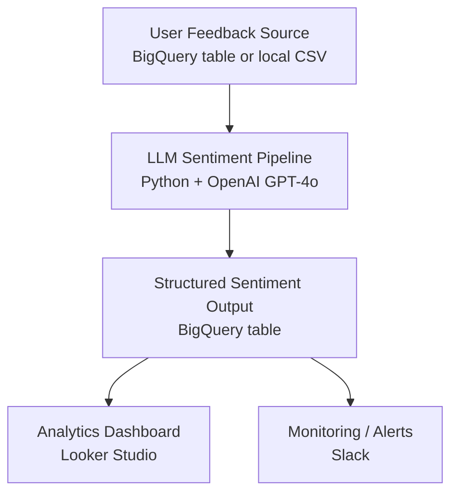

# User Feedback Sentiment (BigQuery + GPT-4o)

[](https://opensource.org/licenses/MIT)
[](https://www.python.org/)
[](https://cloud.google.com/bigquery)
[](https://openai.com/)
[](https://github.com/space-lumps/user-feedback-sentiment-bq/releases)

This project analyzes structured user feedback (thumbs up/down, flags, and comments) using a fine-grained LLM-based sentiment scoring system. It processes data from a BigQuery table, generates numerical sentiment scores and aspect labels via OpenAI’s GPT-4o, and stores the results back in BigQuery for visualization and monitoring.

## Project Goal

Convert unstructured user feedback (thumbs, flags, comments) into structured sentiment metrics using an LLM so product teams can quantify user satisfaction and identify UX issues in analytics dashboards.

## Features

- Classifies feedback sentiment with **numerical intensity from -2 to +2**
- Extracts structured labels for **sentiment type** and **feedback aspect**
- Uses **GPT-4o** with a constrained JSON output schema
- Supports **two execution modes**:
  - **Local CSV mode** for testing and development
  - **BigQuery mode** for production pipelines
- Includes:
  - retry logic for OpenAI API calls
  - strict JSON parsing and validation
  - optional Slack notifications for pipeline runs

## Architecture

The pipeline processes user feedback using an LLM to produce structured sentiment labels that can be analyzed in analytics dashboards.



## Stack

- Python 3.11
- OpenAI GPT-4o API (temperature=0)
- Google BigQuery
- `.env` for secret management (for local testing only--prod version incorporates Google Secret manager)
- Optional: Looker Studio (for dashboards), Slack (for alerts)

## Project Structure

```
user-feedback-sentiment-bq/
├── src/                                   # Main Python code
│   ├── llm_feedback_pipeline.py           # Core LLM + BigQuery sentiment pipeline
│   ├── test_llm_mini_pipeline.py          # Quick local test on small hardcoded/sample data
│   └── test_llm_on_full_dataset.py        # End-to-end test against real BigQuery (use with caution)
├── sql/
│   └── user_feedback_and_flags_model.sql  # Source table schema / view definition
├── docs/
│   └── llm_feedback_pipeline_plan.md      # Early design notes & prompt thinking trace
├── requirements.txt
├── .gitignore
├── LICENSE
└── README.md
```

## How It Works

The pipeline can run in **two modes**.

### Local Development Mode

1. Load feedback rows from `sample_feedback.csv`
2. Send each comment to GPT-4o
3. Parse structured JSON output
4. Save results to a local CSV file

### Production Mode

1. Query new feedback rows from BigQuery
2. Send each comment to GPT-4o
3. Parse structured JSON output
4. Append results to a BigQuery output table
5. Optionally send a Slack notification when processing completes

## Example LLM Classification

Example input row:

System message:

> "You can improve your resume by adding measurable achievements."

User comment:

> "This advice was helpful but the example link was broken."

LLM output:

```json
{
  "sentiment_score": 1,
  "sentiment_type": "suggestion",
  "aspect": "completeness"
}
```

## Running the Pipeline Locally

1. **Install dependencies**:

```bash
pip install -r requirements.txt
```

1. **Set up your `.env`**:

Local development requires:

```
OPENAI_API_KEY=your-key-here
BIGQUERY_PROJECT=your-gcp-project
BIGQUERY_DATASET=your-dataset
```

In production, secrets should be retrieved from **Google Secret Manager** instead of `.env`.

1. **Run the test script** (20-row sample):

```bash
python src/test_llm_mini_pipeline.py
```

1. **Run full BigQuery pipeline**:

```bash
python src/llm_feedback_pipeline.py
# or for validation:
python src/test_llm_on_full_dataset.py
```

## Pipeline Modes

The main pipeline (`llm_feedback_pipeline.py`) supports two execution paths.

### Local CSV Mode (default)

Used for development and testing.

Input: `sample_feedback.csv`
Output: `simulated_full_pipeline_local_test.csv`

### BigQuery Mode

Enable by uncommenting the BigQuery section in the script.

Input table: `{project}.{dataset}.user_feedback_and_flags`
Output table: `{project}.{dataset}.feedback_sentiment_output`

## Example Output Schema


| column             | description                                   |
| ------------------ | --------------------------------------------- |
| user_id            | user identifier                               |
| chat_id            | chat session id                               |
| message_id         | message identifier                            |
| timestamp          | original feedback timestamp                   |
| user_comment       | free-text user comment                        |
| system_message     | AI message the user reacted to                |
| source_type        | thumbs / flag source                          |
| user_feedback_type | thumbs_up / thumbs_down / flag                |
| sentiment_score    | integer from -2 to +2                         |
| sentiment_type     | complaint / suggestion / compliment / neutral |
| aspect             | feedback topic classification                 |
| llm_timestamp      | time sentiment analysis was generated         |


## Future Plans

- Add support for multilingual feedback
- Hook into Slack or email alerts on extreme negative feedback
- Compare LLM model performance (Claude vs GPT-4o)
- Export labeled data for model fine-tuning

## Safety & Reliability

The pipeline includes several safeguards:

- retry logic for transient OpenAI API failures
- JSON schema validation before writing results
- duplicate prevention when writing local output
- optional Slack alerts for monitoring scheduled runs

---

## License

MIT License. Feel free to use and adapt this pipeline for your own feedback analysis workflows.

Copyright 2025-2026 Corin Stedman (space-lumps)

See the [LICENSE](LICENSE) file for full details.